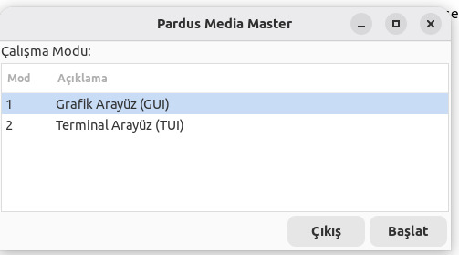
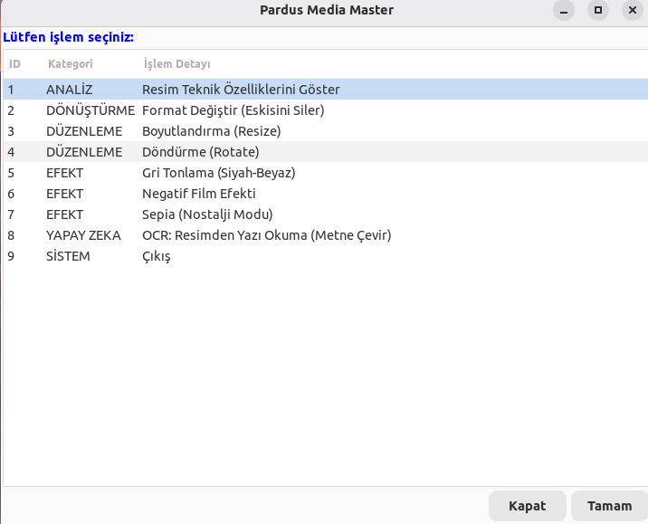
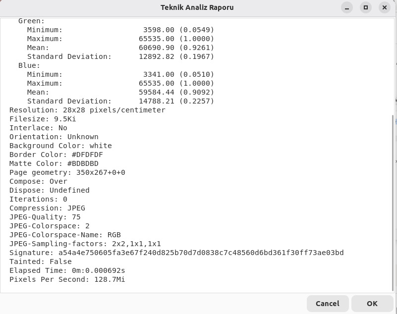
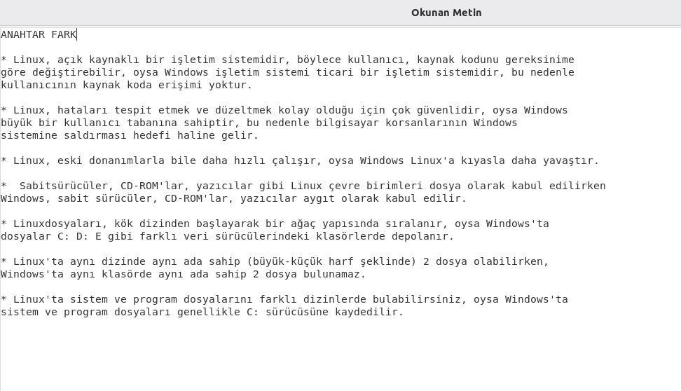
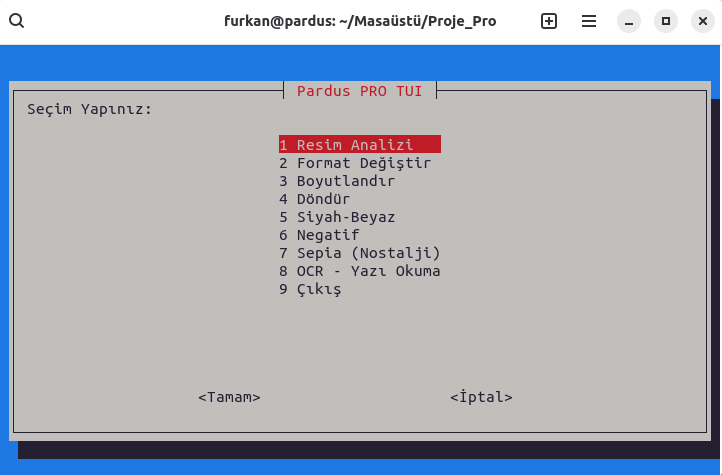
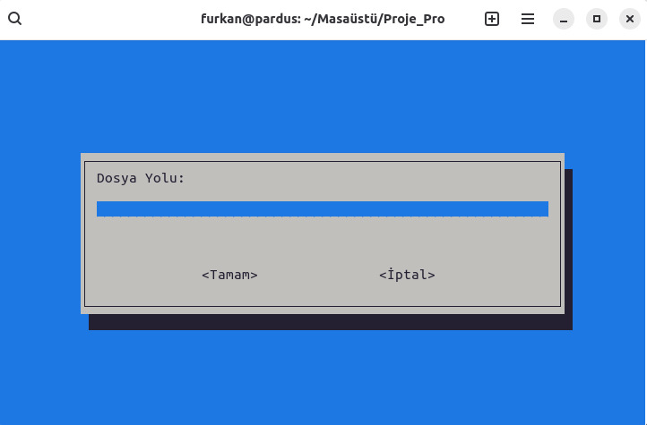
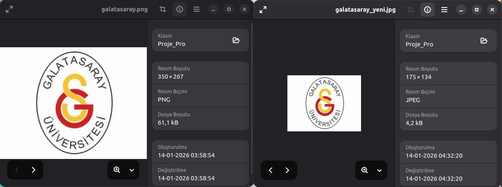
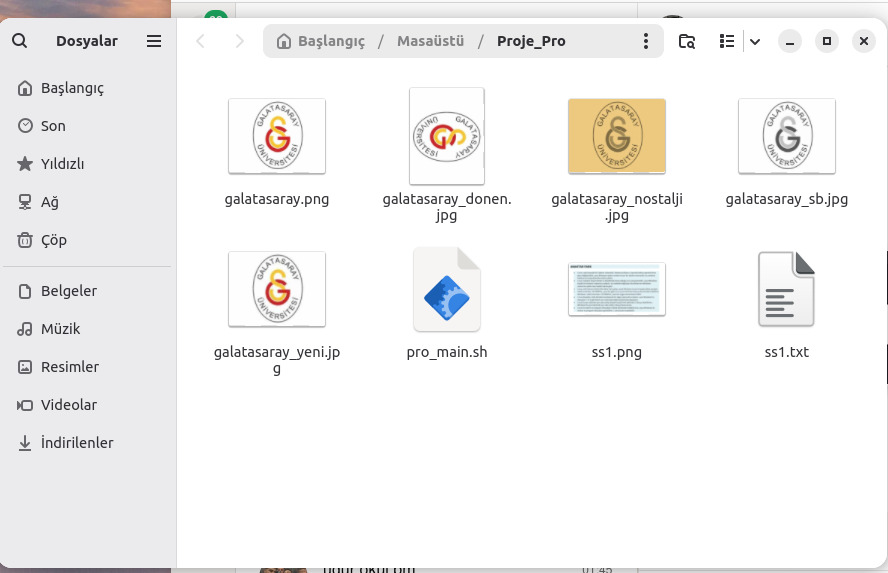

# ImageMagick Tabanlı Resim Dizayn Aracı (GUI & TUI)

> **Linux dünyasında komut satırına hapsolmadan; resim işleme, format dönüştürme ve Yapay Zeka (OCR) işlemlerini tek bir çatı altında toplayan profesyonel bir Bash Script projesi.**



## 📖 Proje Hakkında

Bu proje, **Kabuk Programlama (Shell Scripting)** dersi kapsamında geliştirilmiştir. Temel amacı, Linux terminalinde güçlü ancak kullanımı karmaşık olan `ImageMagick` ve `Tesseract` gibi araçları, son kullanıcı için basit ve anlaşılır bir arayüze kavuşturmaktır.

Proje geliştirme süreci tamamen **Sanal Makine (Virtual Machine)** üzerine kurulan yerli işletim sistemimiz **Pardus** üzerinde gerçekleştirilmiştir. Pardus'un kararlı yapısı üzerinde test edilen uygulama, hem görsel (GUI) hem de metin tabanlı (TUI) arayüz seçenekleri sunarak her seviyeden kullanıcıya hitap etmektedir.

---

## 🛠️ Kullanılan Teknolojiler ve Araçlar

Bu projenin arkasında yatan güç, aşağıdaki açık kaynak teknolojilerin birleşiminden gelmektedir:

* **Bash Scripting:** Projenin ana omurgası, modüler fonksiyon yapısı.
* **Pardus Linux:** Geliştirme ve test ortamı.
* **YAD (Yet Another Dialog):** Modern ve kullanıcı dostu Grafik Arayüz (GUI) tasarımı için.
* **Whiptail:** Terminal tabanlı menüler (TUI) için.
* **ImageMagick (Convert/Identify):** Resim işleme, boyutlandırma, döndürme ve efekt işlemleri için.
* **Tesseract OCR:** Resim üzerindeki metinleri okuyup dijital yazıya çeviren Yapay Zeka motoru.

---

## 🖥️ Arayüzler ve Özellikler

Proje açılışta kullanıcıya iki farklı çalışma modu sunar:

### 1. Grafiksel Kullanıcı Arayüzü (GUI)
Fare ve pencere odaklı, modern bir deneyim sunar. YAD kütüphanesi ile tasarlanmıştır.

**Öne Çıkan Özellikler:**
* **Akıllı Format Dönüştürme:** JPG, PNG, PDF arası dönüşüm.
* **Yapay Zeka Destekli OCR:** Resimdeki yazıları okuyup metne çevirir.
* **Teknik Analiz:** Resimlerin EXIF ve boyut bilgilerini raporlar.

| Ana Menü Görünümü | Detaylı Analiz Raporu |
| :---: | :---: |
|  |  |

#### ✨ Yapay Zeka (OCR) ve Efekt Örnekleri
**OCR Sonucu (Resimden Yazı Okuma):**
Kitap sayfası veya belge fotoğraflarındaki yazıları yüksek doğrulukla okur.


**Nostalji (Sepia) Efekti Uygulanmış Resim:**


---

### 2. Terminal Tabanlı Arayüz (TUI)
Düşük sistem kaynağı tüketen, klavye ile yönetilen hızlı arayüz. Whiptail kütüphanesi ile tasarlanmıştır.

**Öne Çıkan Özellikler:**
* Sistem yöneticileri ve terminal severler için optimize edilmiştir.
* GUI sürümündeki tüm temel fonksiyonları (Boyutlandırma, Döndürme, Efekt) destekler.



#### ⚡ Hızlı İşlem Akışı
Kullanıcıdan dosya yolu ve işlem detaylarını interaktif olarak alır.

| Dosya Yolu Girişi | Döndürme Açısı Seçimi |
| :---: | :---: |
|  |  |

#### 📉 Boyutlandırma Kanıtı (Before/After)
Aşağıdaki görselde, **61.1 kB** boyutundaki bir PNG dosyasının, boyutlandırma işlemi sonrası **4.2 kB** boyutunda bir JPG dosyasına nasıl dönüştüğü ve sıkıştırıldığı görülmektedir.



**Siyah-Beyaz (Grayscale) Dönüşüm Sonucu:**


---

## 📂 Proje Çıktısı (Klasör Yapısı)
İşlemler tamamlandığında klasör yapısı aşağıdaki gibi görünür. Orijinal dosyalar korunur, yeni dosyalar otomatik adlandırılır.



---

## 🚀 İndirme ve Çalıştırma Rehberi

Projeyi bilgisayarınıza indirip hemen test etmek için aşağıdaki adımları sırasıyla uygulayın.

### 1. İndirme ve Hazırlık
Bu sayfanın sağ üst köşesindeki yeşil **"Code"** butonuna tıklayıp **"Download ZIP"** seçeneği ile dosyayı indirin.
* İnen ZIP dosyasını **Masaüstüne** çıkartın.
* Klasörün içinde test etmeniz için örnek resimler (`ornek_metin.jpg`, `ornek_logo.png` vb.) mevcuttur.

### 2. Kurulum (Gerekli Paketlerin Yüklenmesi)
Programın hatasız çalışması için terminali açın ve şu komutu yapıştırarak gerekli kütüphaneleri yükleyin:

```bash
sudo apt update
sudo apt install yad whiptail imagemagick graphicsmagick-imagemagick-compat tesseract-ocr tesseract-ocr-tur -y
